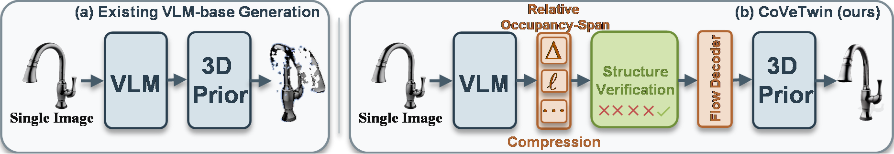
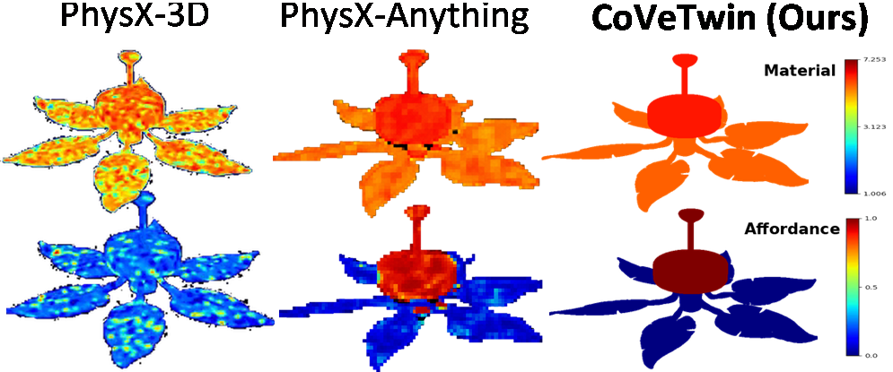
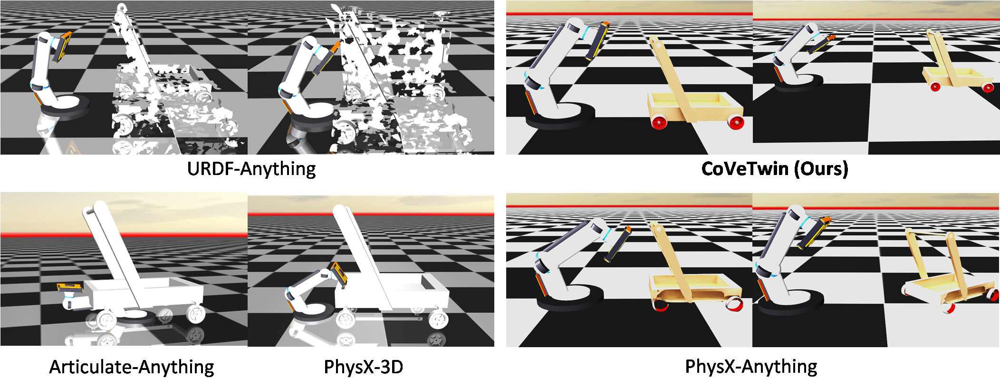
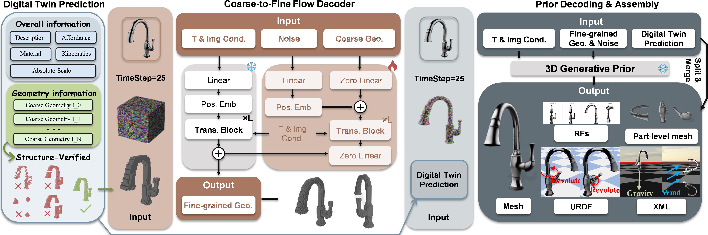
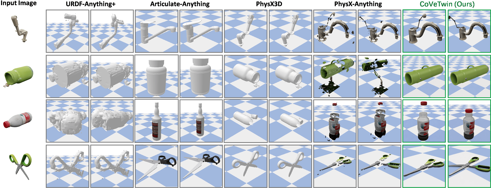
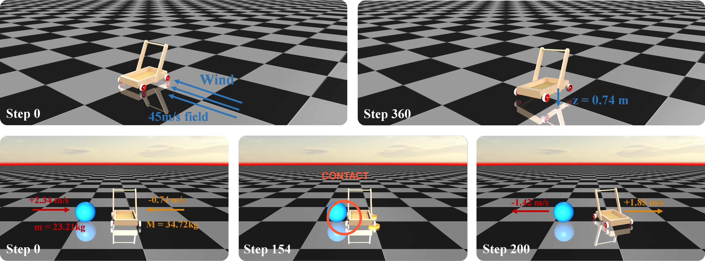

<div align="center">

# CoVeTwin

### Structure-Aware Geometry Compression and Verification for High-Fidelity Articulated Digital Twin Generation from a Single Image

[](paper/CoVeTwin.pdf)
[](media_supplement_aaai/index.html)
[](#installation)
[](#outputs)
[](#testing)
[](LICENSE)

**[Paper](paper/CoVeTwin.pdf) ·
[Media supplement](media_supplement_aaai/README.md) ·
[Installation](#installation) ·
[Inference](#inference) ·
[Evaluation](#evaluation)**

CoVeTwin reconstructs a high-fidelity, articulated, physically annotated and
simulation-ready digital twin from a single RGB or RGBA image.



</div>

## Overview

Single-image articulated reconstruction is severely underconstrained: geometry
is only partially observed, long geometry sequences are difficult for a vision
language model (VLM) to predict, and malformed or fragmented coarse geometry
can propagate into every downstream stage. CoVeTwin addresses these issues with
two geometry-centered components:

- **Relative occupancy-span compression** converts part-level voxel geometry
  into a compact, exactly recoverable sequence without introducing a dedicated
  3D tokenizer. It reduces the average target length from **177,450 to 767
  tokens per part** (about **231×**) and is 16.5% shorter than absolute spans.
- **Connectivity-based structure verification** samples multiple coarse
  geometry candidates, rejects invalid predictions and prioritizes coherent
  structures before high-resolution reconstruction.
- **Coarse-to-fine flow refinement** combines the verified coarse occupancy
  with the source image to restore detailed, textured geometry.
- **Complete digital-twin export** binds part semantics, material, affordance,
  scale and articulation to refined meshes and exports JSON, GLB, URDF and
  MuJoCo XML assets.

<div align="center">

<br>
<em>CoVeTwin predicts compact part geometry and physical structure, verifies
coarse candidates, refines the selected structure and exports simulator-ready
assets.</em>
</div>

## Method

Given one image, CoVeTwin:

1. predicts object/part semantics, absolute scale, physical attributes and
   kinematic relationships with a shared VLM;
2. represents each part using relative occupancy spans and samples multiple
   geometry candidates;
3. filters malformed candidates and evaluates the remaining candidates using
   voxel occupancy and 6-connectivity statistics;
4. refines the merged coarse geometry with an image-conditioned flow decoder,
   transfers part labels and exports the articulated asset.

### Relative occupancy-span compression

For a voxel `(x, y, z)` on an `R³` grid, CoVeTwin uses the lexicographic index

```text
q = x * R² + y * R + z
```

Consecutive indices are merged into spans. If `b` is the first span start,
each span is stored using a relative offset `delta` and length `length`:

```text
delta  = span_start - b
length = span_end - span_start + 1
```

The repository protocol serializes a part as:

```text
rss <base> <relative_start>:<length> ...
```

For example:

```text
absolute spans: [184,184] [198,216] [230,237]
CoVeTwin:       rss 184 0:1 14:19 46:8
```

<div align="center">

<br>
<em>From the original mesh sequence to relative occupancy spans: the proposed
representation preserves exact recovery while substantially shortening the
VLM target.</em>
</div>

### Structure verification and refinement

For each part, the VLM samples `K` candidate geometry strings. CoVeTwin first
rejects candidates that are malformed, empty, overlapping, unordered or
outside the voxel grid. Valid candidates are assessed using their occupied
voxel count, number of 6-connected components and largest-component ratio.
The selected part occupancies are merged, refined by the conditional flow
decoder and transferred to fine-grained part meshes.

## Results

### Geometry and articulation

The following results are evaluated on 388 held-out PhysX-Mobility objects and
averaged over three inference runs. CD is reported in `×10³`, scale and origin
errors in centimeters, and axis error in degrees.

| Method | PSNR ↑ | CD ↓ | F-score ↑ | Scale Err. ↓ | Joint Acc. ↑ | Axis Err. ↓ | Origin Err. ↓ | Range Err. ↓ |
|---|---:|---:|---:|---:|---:|---:|---:|---:|
| Articulate Anything | 19.362 | 8.005 | 0.815 | **17.191** | 0.631 | 28.863 | 12.823 | 1.245 |
| PhysX-3D | 15.791 | 2.067 | 0.924 | 25.640 | 0.012 | 60.228 | 20.953 | 0.680 |
| PhysX-Anything | 18.592 | 1.447 | 0.957 | 26.262 | 0.896 | 0.787 | 9.574 | 0.711 |
| URDF-Anything+ | 16.898 | 1.615 | 0.945 | 26.723 | 0.452 | 54.648 | 13.341 | 1.107 |
| **CoVeTwin** | **21.003** | **1.368** | **0.959** | 20.856 | **0.905** | **0.651** | **6.962** | **0.607** |

<div align="center">

<br>
<em>Qualitative comparison on annotated and real-world images. Each method is
shown in two articulation states.</em>
</div>

### Physical properties and simulation

| Method | Material F1 ↑ | Affordance F1 ↑ | MuJoCo Exec. ↑ | Joint Traj. Err. ↓ | Contact Stability ↑ |
|---|---:|---:|---:|---:|---:|
| PhysX-3D | 0.448 | 0.496 | 85.2% | 0.286 | 0.724 |
| PhysX-Anything | 0.851 | 0.834 | 93.4% | 0.174 | 0.863 |
| **CoVeTwin** | **0.941** | **0.922** | **100.0%** | **0.128** | **0.917** |

<div align="center">

<br>
<em>Material-dependent density (top) and affordance (bottom) are bound to the
refined part surfaces with clear spatial boundaries.</em>
</div>

<br>

<div align="center">

<br>
<em>Generated assets loaded and actuated in MuJoCo. CoVeTwin maintains coherent
geometry and stable interaction.</em>
</div>

## Ablation

The full method is compared with voxel coordinates, voxel indices, absolute
spans and relative occupancy spans without verification. The complete model
produces more complete geometry, more coherent articulation and more spatially
consistent physical-property maps.

<div align="center">

</div>

## Paper and supplementary material

- **Main paper:** [CoVeTwin.pdf](paper/CoVeTwin.pdf)
- **Offline media gallery:** clone or download the repository, then open
  [`media_supplement_aaai/index.html`](media_supplement_aaai/index.html) in a
  modern browser.
- **Media guide:** [contents and viewing order](media_supplement_aaai/README.md)

The media supplement contains benchmark articulation playback, real-world
examples, cross-method dynamics and controlled dynamic ablations. The static
overview below previews the shared-input cross-method comparison.

<div align="center">
<a href="media_supplement_aaai/index.html">

</a>
</div>

<details>
<summary><strong>Additional method details: verification and flow refinement</strong></summary>
<br>

</details>

<details>
<summary><strong>Additional AKB-48 qualitative results</strong></summary>
<br>

</details>

<details>
<summary><strong>Simulation under external forces and object contact</strong></summary>
<br>

</details>

## Installation

The tested environment uses Python 3.10 and CUDA 11.8.

```bash
conda create -n covetwin python=3.10 -y
conda activate covetwin
pip install -r requirements.txt
```

Compile the CUDA extensions required by the high-resolution decoder:

```bash
. ./setup.sh --basic --xformers --flash-attn --diffoctreerast \
  --spconv --mipgaussian --kaolin --nvdiffrast
```

Install the VLM dependencies:

```bash
pip install transformers==4.50.0 qwen-vl-utils 'accelerate>=0.26.0'
```

Hugging Face downloads can use the mirror endpoint:

```bash
export HF_ENDPOINT=https://hf-mirror.com
```

## Checkpoints

Download the compatible base checkpoints:

```bash
HF_ENDPOINT=https://hf-mirror.com python tools/download_checkpoints.py
```

The decoder expects weights under `pretrain/decoder`. Place a CoVeTwin VLM
checkpoint trained with the relative occupancy-span protocol under
`pretrain/covetwin_vlm`, or pass a custom path through `--ckpt`.

```text
pretrain/
|-- decoder/
`-- covetwin_vlm/
```

The legacy `pretrain/vlm` checkpoint uses an absolute-span response format and
is not a drop-in CoVeTwin checkpoint.

## Inference

Place one input image per object in a directory. The filename stem becomes the
sample ID.

```bash
HF_ENDPOINT=https://hf-mirror.com \
CUDA_VISIBLE_DEVICES=0,1,2,3 \
python run_covetwin.py \
  --demo-path demo \
  --output-path test_covetwin \
  --ckpt pretrain/covetwin_vlm \
  --candidate-count 5 \
  --stages 1 2 3 4
```

Use `--remove-bg` for ordinary photographs that require foreground extraction.
Keep the default `--no-remove-bg` for RGBA images or clean rendered inputs.
Use `--dry-run` to inspect all stage commands without loading the models.

### Selected samples or stages

```bash
# Run only samples 0 and 10.
python run_covetwin.py \
  --demo-path demo \
  --output-path test_covetwin \
  --ckpt pretrain/covetwin_vlm \
  --only 0 10

# Run only refinement, part transfer and simulator export.
python run_covetwin.py \
  --demo-path demo \
  --output-path test_covetwin \
  --stages 2 3 4
```

## Outputs

```text
test_covetwin/<sample_id>/
|-- basic_info.txt
|-- coord_<part>.txt
|-- ind_<part>.npy
|-- allind.npy
|-- candidates/
|   `-- part_<part>/candidate_<k>.txt
|-- candidate_verification.json
|-- sample.glb
|-- objs/<part>/<part>.obj
|-- basic_info.json
|-- basic.urdf
`-- basic.xml
```

`candidate_verification.json` records candidate validity, occupancy and
connectivity statistics, and the selected candidate for each part.
`basic.urdf` supports URDF-compatible engines; `basic.xml` is the MuJoCo asset.

## Training

Build the two-turn Qwen-VL training records from PhysX-Mobility:

```bash
python training/build_dataset.py \
  --voxel-root dataset/tmp_mobility/partseg \
  --structure-root dataset/txt_rep_32_finetune_mobility_all \
  --image-root dataset_toolkits/renders_all \
  --representation relative_span \
  --output dataset/covetwin_training/conversations_train.json
```

Then fine-tune Qwen2.5-VL:

```bash
cd qwen-vl-finetune

export HF_ENDPOINT=https://hf-mirror.com
export CUDA_VISIBLE_DEVICES=0,1,2,3
export NUM_GPUS=4
export COVETWIN_ANNOTATION_PATH=../dataset/covetwin_training/conversations_train.json
export COVETWIN_IMAGE_ROOT=../dataset_toolkits/renders_all
export OUTPUT_DIR=./output_covetwin_7b

bash scripts/run_sft_covetwin.sh
```

## Evaluation

The unified evaluator covers rendering, surface quality, metric scale,
physical attributes, articulation and physics-engine execution:

```bash
python evaluate_covetwin_metrics.py \
  --pred-roots test_covetwin \
  --dataset-root dataset/PhysX_mobility \
  --renders-root dataset_toolkits/renders_all \
  --output-dir evaluation_results/covetwin
```

Optional baseline roots can be supplied through `--articulate-roots`,
`--urdf-anything-roots` and `--physx3d-roots`.

## Code structure

| Component | Implementation |
|---|---|
| Relative occupancy-span codec | [`covetwin/geometry_codec.py`](covetwin/geometry_codec.py) |
| Candidate validity and verification | [`covetwin/verification.py`](covetwin/verification.py) |
| Conditional flow objective | [`covetwin/flow_matching.py`](covetwin/flow_matching.py) |
| Two-turn VLM inference | [`covetwin/inference.py`](covetwin/inference.py) |
| Fine-tuning data construction | [`training/build_dataset.py`](training/build_dataset.py) |
| End-to-end launcher | [`run_covetwin.py`](run_covetwin.py) |
| Geometry reasoning | [`pipeline/1_geometry_reasoning.py`](pipeline/1_geometry_reasoning.py) |
| High-resolution flow decoding | [`pipeline/2_flow_reconstruction.py`](pipeline/2_flow_reconstruction.py) |
| Part-label transfer | [`pipeline/3_part_segmentation.py`](pipeline/3_part_segmentation.py) |
| URDF and MJCF export | [`pipeline/4_simulation_export.py`](pipeline/4_simulation_export.py) |
| Unified evaluation | [`evaluate_covetwin_metrics.py`](evaluate_covetwin_metrics.py) |

## Testing

The deterministic test suite covers geometry codecs, candidate verification,
the flow objective, ablation formats and the stage-1 file contract:

```bash
python -m unittest discover -s tests -p 'test_covetwin*.py' -v
```

The 13 tests do not require VLM or decoder weights.

## Citation

The manuscript is currently anonymized. Replace the author field with the
camera-ready author list when available.

```bibtex
@article{covetwin2026,
  title  = {CoVeTwin: Structure-Aware Geometry Compression and Verification
            for High-Fidelity Articulated Digital Twin Generation from a
            Single Image},
  author = {CoVeTwin Authors},
  year   = {2026}
}
```

## Acknowledgements

CoVeTwin builds on Qwen2.5-VL, TRELLIS and the simulation-ready asset pipeline
and data conventions established by PhysX-Anything and PhysX-Mobility. We
thank the authors and maintainers of these projects. Third-party components
and datasets remain subject to their respective licenses.

## License

This repository is distributed under the [S-Lab License 1.0](LICENSE) for
non-commercial use. Commercial use requires permission from the contributors,
as specified in the license.
