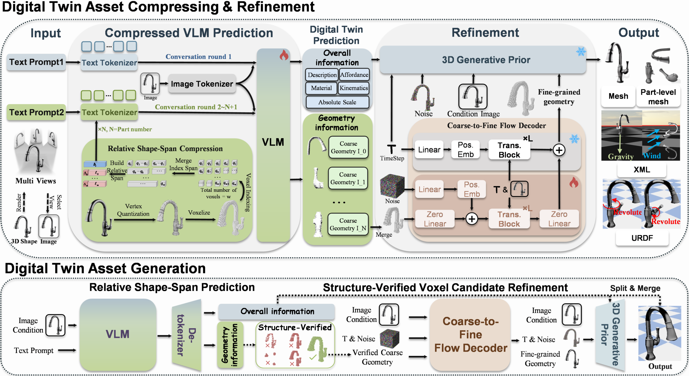
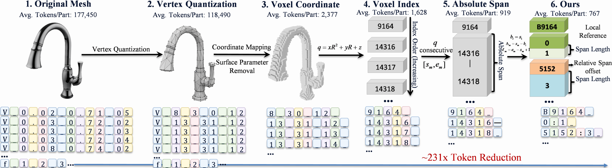
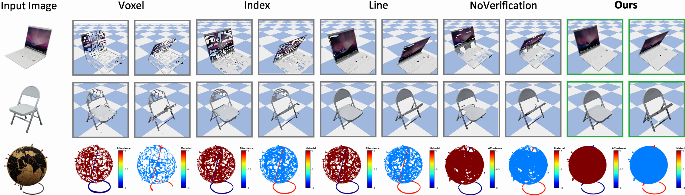

<div align="center">

# CoVeTwin

### Compact-and-Verified Geometry Modeling for High-Fidelity Articulated Digital Twin Generation from a Single Image

[](docs/CoVeTwin.pdf)
[](docs/REPRODUCIBILITY.md)
[](#installation)
[](#output-format)
[](#testing)
[](LICENSE)

CoVeTwin reconstructs a high-fidelity, articulated, physically annotated and
simulation-ready digital twin from a single RGB or RGBA image. It combines
compact part-level geometry prediction, structure-aware candidate verification
and image-conditioned coarse-to-fine flow refinement, then exports refined
meshes together with semantics, physical attributes and articulation as URDF
and MuJoCo XML assets.



</div>

## Highlights

- **Relative shape-span compression.** Consecutive occupied voxel indices are
  represented using one local reference, relative span offsets and span
  lengths. The representation is exactly reversible and requires no custom VLM
  vocabulary.
- **Structure-verified inference.** CoVeTwin samples multiple geometry
  candidates for each part, rejects invalid outputs and ranks valid candidates
  using occupancy and 6-connected-component statistics.
- **Coarse-to-fine reconstruction.** The verified coarse occupancy and source
  image condition a flow decoder that restores detailed, textured geometry.
- **Complete digital twins.** The VLM jointly predicts parts, scale, material,
  affordance and articulation. Refined part meshes are exported as JSON, GLB,
  URDF and MuJoCo XML.
- **Unified evaluation.** The repository evaluates rendering, surface quality,
  metric scale, physical attributes, articulation and physics-engine execution.

## Method

### Relative shape-span compression

For an occupied voxel `(x, y, z)` on an `R^3` grid, CoVeTwin first computes

```text
q = x * R^2 + y * R + z
```

Sorted consecutive indices are merged into absolute spans `[s_m, e_m]`. With
the first span start as the local reference `b`, each span becomes

```text
delta_m  = s_m - b
length_m = e_m - s_m + 1
```

The canonical model output is therefore:

```text
rss b delta_1:length_1 delta_2:length_2 ...
```

For example:

```text
absolute spans: [184,184] [198,216] [230,237]
CoVeTwin:       rss 184 0:1 14:19 46:8
```

<div align="center">

</div>

### Structure-verified voxel candidates

For every part, the VLM samples `K` candidate geometry strings. Unparsable or
empty candidates are discarded. For a valid candidate, let `n` be its occupied
voxel count, `c` its number of 6-connected components and `rho` the fraction of
voxels in its largest component. CoVeTwin selects the candidate with the
highest score:

```text
Q = 100 * rho - 2 * c + min(n, R^3) / R^3
```

The selected part occupancies are merged and passed to the conditional flow
decoder. Part labels are then transferred from the verified coarse geometry to
the refined mesh before URDF/XML construction.

## Code structure

| Component | Implementation |
|---|---|
| Relative shape-span codec | [`covetwin/geometry_codec.py`](covetwin/geometry_codec.py) |
| Candidate validity and Eq. 16 score | [`covetwin/verification.py`](covetwin/verification.py) |
| Exact conditional flow objective | [`covetwin/flow_matching.py`](covetwin/flow_matching.py) |
| Representation ablations | [`covetwin/ablation_codecs.py`](covetwin/ablation_codecs.py) |
| Two-stage VLM inference | [`covetwin/inference.py`](covetwin/inference.py) |
| Fine-tuning data construction | [`training/build_dataset.py`](training/build_dataset.py) |
| End-to-end stages 1–4 launcher | [`run_covetwin.py`](run_covetwin.py) |
| Geometry reasoning and verification | [`pipeline/1_geometry_reasoning.py`](pipeline/1_geometry_reasoning.py) |
| High-resolution flow decoding | [`pipeline/2_flow_reconstruction.py`](pipeline/2_flow_reconstruction.py) |
| Coarse-to-fine part-label transfer | [`pipeline/3_part_segmentation.py`](pipeline/3_part_segmentation.py) |
| JSON, URDF and MJCF export | [`pipeline/4_simulation_export.py`](pipeline/4_simulation_export.py) |
| Unified quantitative evaluation | [`evaluate_covetwin_metrics.py`](evaluate_covetwin_metrics.py) |

The numbered backend scripts live in `pipeline/` and retain the stage file
contracts required by existing checkpoints. `run_covetwin.py` is the public
end-to-end entry point.

## Repository layout

```text
CoVeTwin/
├── assets/simulation/        # MuJoCo textures and packaged runtime assets
├── configs/                  # TRELLIS model configurations
├── covetwin/                 # Compression, verification, flow, and VLM logic
├── dataset/                  # Preprocessing scripts, prompts, and split metadata
├── dataset_toolkits/         # Blender rendering and dataset utilities
├── demo/                     # Small tracked inference examples
├── docs/                     # Paper and project documents
├── evaluation/               # Unified metrics and isolated render/physics workers
├── img/covetwin/             # Figures used by this README
├── pipeline/                 # Numbered inference stages 1--4
├── qwen-vl-finetune/         # Qwen2.5-VL fine-tuning stack
├── qwen-vl-utils/            # Local Qwen-VL image-processing utilities
├── tests/                    # Deterministic unit and contract tests
├── tools/                    # Downloads, visualization, ablations, and benchmarks
├── training/                 # CoVeTwin training-data construction
├── trellis/                  # High-resolution 3D decoder implementation
├── evaluate_covetwin_metrics.py
└── run_covetwin.py
```

Large datasets, checkpoints, local experiments, generated meshes, videos, and
evaluation outputs are intentionally excluded by `.gitignore`.

## Installation

The tested environment uses Python 3.10 and CUDA 11.8.

```bash
conda create -n covetwin python=3.10 -y
conda activate covetwin
pip install -r requirements.txt
```

To compile the CUDA extensions used by the high-resolution decoder, the
existing setup helper can be used:

```bash
. ./setup.sh --basic --xformers --flash-attn --diffoctreerast \
  --spconv --mipgaussian --kaolin --nvdiffrast
```

The VLM stage additionally requires:

```bash
pip install transformers==4.50.0 qwen-vl-utils 'accelerate>=0.26.0'
```

All Hugging Face commands in this project support the mirror endpoint:

```bash
export HF_ENDPOINT=https://hf-mirror.com
```

## Checkpoints

The decoder expects its weights under `pretrain/decoder`. A CoVeTwin VLM
checkpoint must be trained on the relative shape-span protocol or placed at a
custom path and supplied through `--ckpt`.

Download the compatible base checkpoints through the configured Hugging Face
mirror with:

```bash
HF_ENDPOINT=https://hf-mirror.com python tools/download_checkpoints.py
```

The legacy `pretrain/vlm` checkpoint was trained for an absolute-span response
format and is not automatically a CoVeTwin checkpoint. The strict CoVeTwin
parser intentionally rejects legacy responses that do not follow the `rss`
protocol.

Expected layout:

```text
pretrain/
├── decoder/
└── covetwin_vlm/
```

## Training

The exact dataset split, hyperparameters, random seeds, hardware/software
environment, metric formulas, and known protocol limitations are documented in
the [reproducibility and technical supplement](docs/REPRODUCIBILITY.md).

### 1. Build two-stage conversations

The following command builds Qwen-VL records from PhysX-Mobility voxel labels,
structured descriptions and rendered views:

```bash
mapfile -t TRAIN_IDS < <(
  python -c "import numpy as np; print(*np.load('dataset/splits/trainingset.npy', allow_pickle=True).tolist(), sep='\n')"
)

python training/build_dataset.py \
  --voxel-root dataset/tmp_mobility/partseg \
  --structure-root dataset/txt_rep_32_finetune_mobility_all \
  --image-root dataset_toolkits/renders_all \
  --representation relative_span \
  --only "${TRAIN_IDS[@]}" \
  --output dataset/covetwin_training/conversations_train.json
```

Each record contains a global prediction turn for parts, articulation and
physical attributes, followed by a part-specific relative shape-span turn.

### 2. Fine-tune Qwen2.5-VL

```bash
cd qwen-vl-finetune

export HF_ENDPOINT=https://hf-mirror.com
export CUDA_VISIBLE_DEVICES=0,1,2,3
export NUM_GPUS=4
export COVETWIN_ANNOTATION_PATH=../dataset/covetwin_training/conversations_train.json
export COVETWIN_IMAGE_ROOT=../dataset_toolkits/renders_all
export OUTPUT_DIR=./output_covetwin_7b

bash scripts/run_sft_covetwin.sh
```

`MODEL`, `EPOCHS`, `BATCH_SIZE`, `GRAD_ACCUM_STEPS`, `MODEL_MAX_LENGTH` and
other settings can be overridden through environment variables.

## Inference

Place one image per object in an input directory. Its filename stem becomes the
sample ID.

### Complete pipeline

```bash
cd /path/to/CoVeTwin

HF_ENDPOINT=https://hf-mirror.com \
CUDA_VISIBLE_DEVICES=0,1,2,3 \
python run_covetwin.py \
  --demo-path demo \
  --output-path test_covetwin \
  --ckpt qwen-vl-finetune/output_covetwin_7b \
  --candidate-count 5 \
  --stages 1 2 3 4
```

Use `--remove-bg` for ordinary photographs when foreground extraction is
needed. Keep the default `--no-remove-bg` for RGBA images or clean rendered
inputs. Use `--dry-run` to print all stage commands without loading models.

### Selected samples or stages

```bash
# Run only samples 0 and 10.
python run_covetwin.py \
  --demo-path demo \
  --output-path test_covetwin \
  --ckpt pretrain/covetwin_vlm \
  --only 0 10

# Run only decoding, part transfer and simulation-ready export.
python run_covetwin.py \
  --demo-path demo \
  --output-path test_covetwin \
  --stages 2 3 4
```

## Output format

```text
test_covetwin/<sample_id>/
├── basic_info.txt
├── coord_<part>.txt
├── ind_<part>.npy
├── allind.npy
├── candidates/
│   └── part_<part>/candidate_<k>.txt
├── candidate_verification.json
├── sample.glb
├── objs/<part>/<part>.obj
├── basic_info.json
├── basic.urdf
└── basic.xml
```

`candidate_verification.json` stores validity, occupied voxel count, component
count, largest-component ratio, verification score and the selected candidate
for every part. `basic.urdf` can be loaded by URDF-compatible engines, while
`basic.xml` is the MuJoCo asset.

## Ablation studies

The four geometry-representation datasets use the same train-only object list
and prompts apart from their serialization. Load `TRAIN_IDS` as shown in the
training section before running:

```bash
for rep in voxel index absolute_span relative_span; do
  python training/build_dataset.py \
    --representation "${rep}" \
    --only "${TRAIN_IDS[@]}" \
    --output "dataset/covetwin_training/${rep}.json"
done
```

The no-verification variant selects candidate zero without score-based ranking:

```bash
python run_covetwin.py \
  --demo-path demo \
  --output-path test_covetwin_noverification \
  --ckpt pretrain/covetwin_vlm \
  --candidate-count 5 \
  --no-verify-candidates \
  --stages 1 2 3 4
```

<div align="center">

</div>

## Evaluation

The unified evaluator supports CoVeTwin and the Articulate-Anything,
URDF-Anything and PhysX-3D baselines under one protocol:

```bash
python evaluate_covetwin_metrics.py \
  --pred-roots test_covetwin \
  --dataset-root dataset/PhysX_mobility \
  --renders-root dataset_toolkits/renders_all \
  --output-dir evaluation_results/covetwin
```

Optional baseline roots can be added with `--articulate-roots`,
`--urdf-anything-roots` and `--physx3d-roots`.

The evaluator reports:

- PSNR, Chamfer Distance and F-score;
- absolute metric-scale error;
- material and affordance macro-F1;
- joint-type accuracy;
- joint-axis, origin and motion-range errors;
- physics-engine execution success rate.

## Testing

The codec, candidate verifier, flow objective, ablation formats and stage-1
file contract are covered by deterministic tests:

```bash
python -m unittest discover -s tests -p 'test_covetwin*.py' -v
```

The current suite contains 13 tests and does not require loading VLM or decoder
weights.

## Citation

The manuscript is currently anonymized. Replace the author field with the
camera-ready author list when it becomes available.

```bibtex
@article{covetwin2026,
  title   = {CoVeTwin: Compact-and-Verified Geometry Modeling for High-Fidelity
             Articulated Digital Twin Generation from a Single Image},
  author  = {CoVeTwin Authors},
  year    = {2026}
}
```

## Acknowledgements

CoVeTwin builds on Qwen2.5-VL, TRELLIS and the simulation-ready asset pipeline
and data conventions established by PhysX-Anything and PhysX-Mobility. We thank
the authors and maintainers of these projects. Third-party components and
datasets remain subject to their respective licenses.

## License

This repository is distributed under the [S-Lab License 1.0](LICENSE). It is
available for non-commercial use; commercial use requires permission from the
contributors, as specified in the license.
